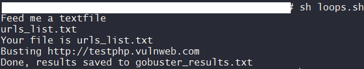

# gobuster_looper

Bust directory's from a text file.

## Notes

- This assumes you have [gobuster](https://github.com/OJ/gobuster) installed

- This is a terrible tool written in less than a few hours, improvements will be made but use at your own risk.


## Usage

```bash
git clone https://github.com/thetrebelcc/gobuster_looper
cd gobuster_looper
sh gobuster_looper.sh
type in txt.file
then type in the path to the wordlist
```

- gobuster then runs taking in URLs from the text file and the worlist file. Results are saved to gobuster_results.txt


## Example



## License
[MIT](https://choosealicense.com/licenses/mit/)
